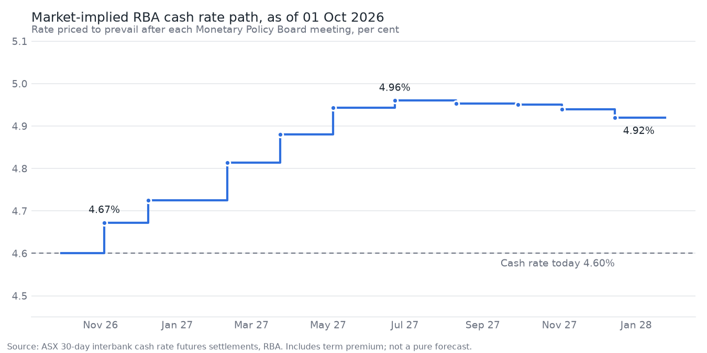

# Latest: 01 October 2026

_Regenerated by every daily update from ASX 24 settlements. Not investment advice._

Cash rate **4.60%** | 3-year futures yield **4.99%** | 10-year **5.42%** | 3s10s **44bp**

## Priced for each meeting

| Meeting | Implied rate | Priced move (bp) | As share of 25bp | Cumulative (bp) |
|---|---|---|---|---|
| 03 Nov 2026 | 4.67% | +7.2 | +29% | +7.2 |
| 08 Dec 2026 | 4.72% | +5.3 | +21% | +12.5 |
| 09 Feb 2027 | 4.81% | +8.8 | +35% | +21.3 |
| 23 Mar 2027 | 4.88% | +6.7 | +27% | +28.0 |
| 04 May 2027 | 4.94% | +6.3 | +25% | +34.3 |
| 22 Jun 2027 | 4.96% | +1.7 | +7% | +36.0 |
| 10 Aug 2027 | 4.95% | -0.7 | -3% | +35.3 |
| 28 Sep 2027 | 4.95% | -0.3 | -1% | +35.0 |
| 02 Nov 2027 | 4.94% | -1.1 | -4% | +33.9 |
| 14 Dec 2027 | 4.92% | -1.9 | -8% | +32.0 |

## Next meeting: model vs market

| Outcome | Model | Model + nowcast | Market |
|---|---|---|---|
| cut | 7% | 10% | 0% |
| hold | 78% | 80% | 71% |
| hike | 15% | 10% | 29% |

## Open positions

_None._

Full trade and forecast record: [SCORECARD.md](SCORECARD.md)
