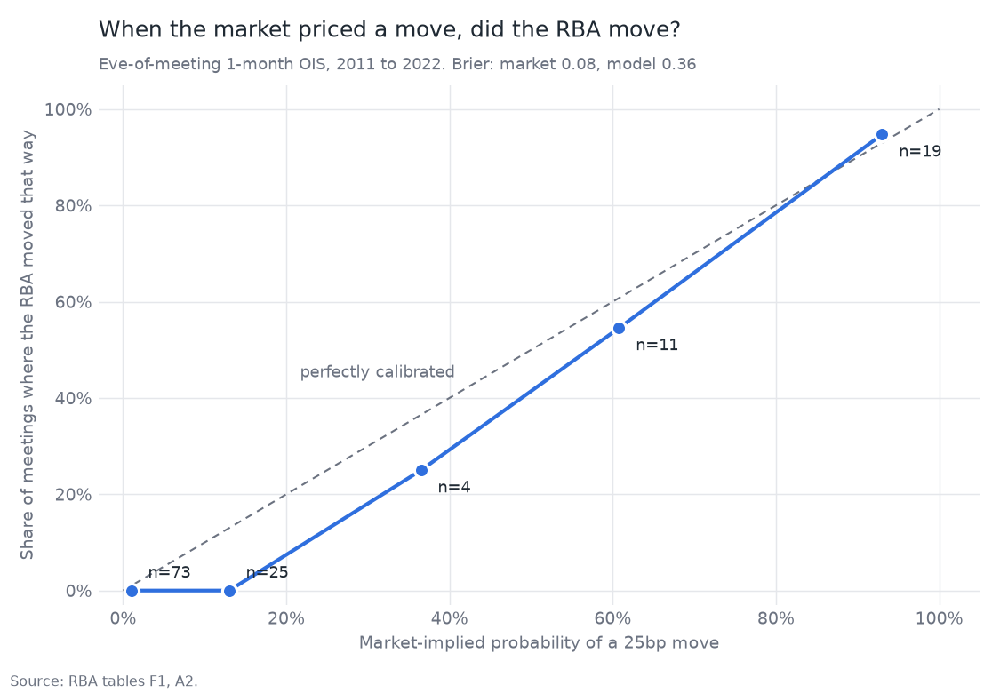
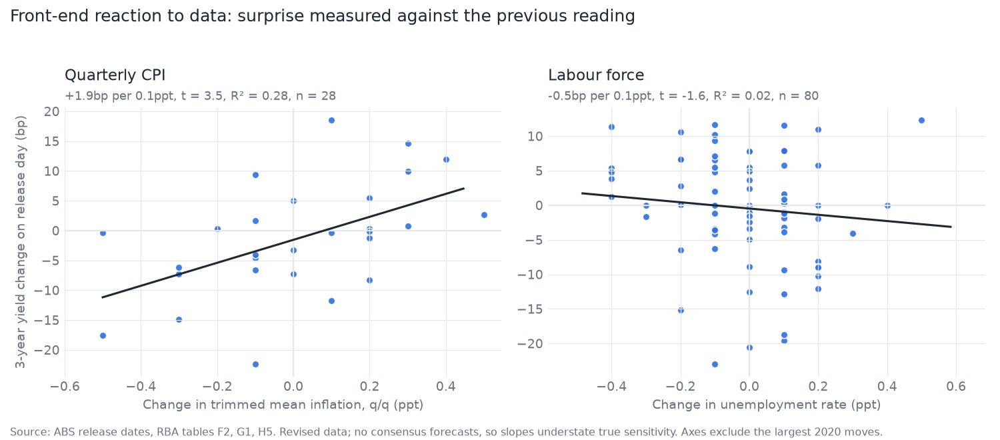

# RBA pricing and trade expression engine

Tracks what the Australian rates market is pricing for the RBA, and keeps a
timestamped paper trading record of views expressed in ASX 24 futures.

The question this project asks is not "can I out-forecast the market" but
"what is priced, where and why might I disagree, what is the right instrument,
and how much do I risk". Every note and trade is committed before the event it
is a view on, losers included.

**[Latest pricing](LATEST.md)** (updated each trading day) | **[Scorecard](SCORECARD.md)** (every trade and forecast, losers included) | **[Notes](notes/)**

## What it does

| Step | Module | Output |
|---|---|---|
| Collect end-of-day settlements for 30-day interbank (IB), 3-year (YT) and 10-year (XT) futures, plus the RBA cash rate | `rbaengine/data.py` | `data/snapshots/YYYY-MM-DD.csv` |
| Strip a meeting-by-meeting implied cash rate path | `rbaengine/implied_path.py` | `output/implied_path_*.csv`, `.png` |
| Value contracts, compute DV01, size positions by dollar risk | `rbaengine/contracts.py` | |
| Record and mark paper trades | `rbaengine/ledger.py` | `ledger/trades.csv` |
| Estimate an RBA reaction function and backtest it out of sample | `rbaengine/reaction.py` | `output/reaction_backtest.csv` |
| Re-run my [GDP nowcast](https://github.com/robcambridge/aus-gdp-nowcast) on fresh ABS data at any vintage date | `rbaengine/nowcast.py` | `data/nowcast_panel.csv` |
| Event study of 3-year yield moves on CPI and labour force days | `rbaengine/events.py` | `output/event_study.csv`, `.png` |
| Carry and roll-down for bond futures | `rbaengine/carry.py` | |
| Monitor the AU vs US 10-year spread | `rbaengine/crossmarket.py` | `output/au_us_10y_spread.png` |
| Publish every trade, winners and losers | `rbaengine/ledger.py` | [`SCORECARD.md`](SCORECARD.md) |
| Log model and market probabilities daily and score them after each meeting | `rbaengine/tracking.py` | `data/forecast_log.csv`, [`SCORECARD.md`](SCORECARD.md) |
| Scenario map for the next quarterly CPI | `rbaengine/events.py` | |
| Test the model and nowcast against historical market pricing | `rbaengine/markettest.py` | `output/market_test.csv`, `market_calibration.png` |
| Write the weekly note | `rbaengine/report.py` | `notes/YYYY-MM-DD.md` |

## Method

**Implied path.** An IB contract settles at 100 minus the average interbank
overnight cash rate over its month. If a decision takes effect on day *d* of an
*N*-day month:

    avg = ((d - 1) * r_pre + (N - d + 1) * r_post) / N

Where the month after a meeting has no meeting of its own, that contract is
used as a direct read of `r_post`. Otherwise the equation is solved within the
meeting month, chaining `r_pre` from the previous meeting. Rate changes take
effect the business day after the decision.

**Contract maths.** Bond futures are quoted as 100 minus yield and valued as a
notional 6% semi-annual coupon bond with $100,000 face (6 periods for YT, 20 for
XT), so DV01 is recomputed from the price each day. IB is linear at $24.66 per
basis point.

**Ledger rules.** Fills are at the official settlement price of the latest
snapshot, never a price of my choosing. Each trade has a stop, target and
rationale at entry. Position size comes from a fixed dollar risk at the stop.

**Reaction function.** An ordered probit for cut / hold / hike at each scheduled
meeting since 1998, on three inputs: trimmed mean inflation less 2.5, the
unemployment rate less its trailing five-year average, and the two-quarter
change in trimmed mean inflation. Each meeting only sees data published before
it. The backtest refits each January on prior years and predicts that year.

Result (176 meetings, 2010 to September 2026, multi-class Brier score, lower is better):

| Forecast | Brier |
|---|---|
| Ordered probit | 0.386 |
| Historical frequencies | 0.390 |
| Always hold | 0.466 |
| Ordered probit plus direction of previous move | 0.414 |
| Ordered probit plus GDP nowcast | 0.413 |

The model barely beats a know-nothing forecast, and adding policy inertia makes
it worse out of sample despite a strong in-sample coefficient. I read this as:
public macro data alone tells you little about the next meeting that base rates
do not. The model is used as a consistency check on my own view, not as a
signal to trade against the market.

**Does the GDP nowcast help?** The nowcast enters as a growth gap: the
bridge-average nowcast for the latest unpublished quarter less average growth
over the previous ten years, computed point-in-time at each meeting date. In
sample its coefficient is positive and significant (z = 2.5): stronger growth,
more hikes. Out of sample it is a wash before COVID (Brier 0.323 with the
nowcast against 0.327 without, 2010 to 2019) and clearly worse after, because
the 2020-21 rebound produced record growth gaps while the RBA held at the
lower bound. The nowcast is therefore reported next to the base model in each
note but is not the headline.

**Trade expression.** `express` sizes an outright 3-year, an outright 10-year
and a DV01-neutral 3s10s steepener to the same dollar loss at the stop, then
shows P&L under parallel and non-parallel curve moves, so the choice of
instrument is explicit rather than assumed.

**Does anything here beat the market? No.** Market-implied probabilities for
132 meetings from 2011 to 2022 are rebuilt from the 1-month OIS rate the RBA
published daily until December 2022, read on the eve of each meeting.

| Forecast | Brier score |
|---|---|
| Market pricing | 0.077 |
| Historical frequencies | 0.337 |
| Reaction function (out of sample) | 0.355 |

An encompassing regression (ordered probit of the outcome on the market's
signed probability plus one candidate signal) finds that neither the reaction
function (z = 0.7, p = 0.46) nor the GDP nowcast (z = -1.4, p = 0.17) adds
information once market pricing is included. On the eve of a meeting the
market already knows what public macro data can tell it.

One pattern is worth watching: at the 25 meetings where the market priced
between 5% and 25% for a move, the RBA never moved. That is consistent with a
small premium for tail outcomes, but 25 meetings is too few to call it an edge.

**Live forecast record.** Each daily update logs the probability of a cut, hold
or hike at the next meeting from three sources: futures pricing, the reaction
function, and the reaction function with the nowcast. After each decision the
last forecast logged before decision day is scored with the Brier score in
[SCORECARD.md](SCORECARD.md). This is the forward-looking test of whether the
model adds anything to market pricing, and it accumulates one observation per
meeting. A GitHub Actions workflow (`.github/workflows/daily.yml`) runs the
update each trading day and commits the result.

**Scenario map.** `scenario` finds the next quarterly CPI release date from the
ABS calendar and maps each trimmed mean outcome to an expected 3-year yield
move using the event-study sensitivity, with P&L for a long 3-year contract and
for the open book. It is written before the release, not after.

**Carry and roll-down.** `carry` reports, for 3-year and 10-year futures, how
far yields can rise over three months before a long loses money if the curve
is otherwise unchanged. Carry is the yield less funding, scaled by duration,
where funding is the average cash rate priced by the IB strip over the horizon.
Roll-down is the slope of the RBA's interpolated curve below each tenor. The
futures basket and cheapest-to-deliver effects are ignored.

**Cross-market.** `spread` tracks the Australian less US 10-year yield with its
five-year z-score, as context for relative RBA versus Fed views. It is a
monitor only; the ledger trades ASX 24 futures.

**Event study.** Exact release dates are scraped from each ABS release page
(late 2019 onwards) and matched to the same-day change in the 3-year
government bond yield.

| Day type | Days | Mean absolute move | vs ordinary day |
|---|---|---|---|
| Quarterly CPI | 28 | 7.0bp | 2.0x |
| Labour force | 80 | 5.8bp | 1.7x |
| RBA decision | 67 | 5.2bp | 1.5x |
| All other days | 1,559 | 3.5bp | 1.0x |

CPI days move the front end most, more than RBA decision days, which is
consistent with decisions being largely priced by the time they arrive. Each
0.1ppt change in quarterly trimmed mean inflation is associated with about
+1.9bp in the 3-year yield on the day (t = 3.5, R² = 0.28). The unemployment
rate has the expected negative sign but is not significant (-0.5bp per 0.1ppt,
t = -1.6). Surprise here means the change from the previous reading, because
consensus forecasts are not freely available; markets react to actual minus
consensus, so these slopes understate the true sensitivity.

## Limitations

- The reaction function uses today's revised data rather than real-time
  vintages, and proxies full employment with a trailing average.
- The market test reads pricing on the eve of each meeting, when the market's
  advantage is largest. It does not test horizons of weeks or months, and RBA
  OIS data stops in December 2022.

- The stripped path is a risk-neutral expectation and contains a term premium.
  "Probability of a 25bp move" is a pricing convention, reliable for the next
  meeting or two and progressively less so further out.
- IB futures settle on the interbank overnight cash rate, not the target. Any
  spread between the two is treated as zero.
- End-of-day data only. No transaction costs, margin or futures roll.
- Back-month IB contracts trade thinly; their settlements are exchange marks.

## Usage

    pip install -r requirements.txt
    pip install --no-deps https://github.com/robcambridge/aus-gdp-nowcast/archive/f2a072959c8b2e3d5ce2ac507c58b5584b73efae.zip
    python -m rbaengine update          # daily: fetch, strip, chart, mark positions
    python -m rbaengine size YTZ2026 --stop-bp 10 --risk 10000
    python -m rbaengine open YTZ2026 long 35 --stop 94.965 --target 95.265 --rationale "..."
    python -m rbaengine close 1
    python -m rbaengine view            # reaction function: backtest, model vs market
    python -m rbaengine express --stop-bp 10 --risk 10000
    python -m rbaengine carry           # carry and roll-down, 3-year and 10-year
    python -m rbaengine spread          # AU vs US 10-year spread
    python -m rbaengine scorecard       # rewrite SCORECARD.md from the ledger
    python -m rbaengine markettest      # does the model add anything beyond market pricing?
    python -m rbaengine scenario        # scenario map for the next quarterly CPI
    python -m rbaengine events          # event study of CPI and labour force days
    python -m rbaengine note            # weekly note skeleton with section 1 filled in
    python -m pytest

## Roadmap

- [x] Implied path, contract maths, ledger, note generator
- [x] Reaction function: ordered probit on inflation and unemployment gaps, backtested out of sample
- [x] Add the GDP nowcast as an input and test whether it improves the backtest
- [x] Compare outright and curve expressions at equal risk
- [x] Live record of model vs market probabilities, scored after each meeting
- [x] Test the model and nowcast against historical market pricing (OIS, 2011 to 2022)
- [x] Event study: front-end move on CPI and labour force days (change-from-previous surprise)
- [ ] Redo the event study with consensus forecasts (needs Bloomberg survey medians)
- [x] Carry and roll-down, AU vs US spread monitor, public scorecard
