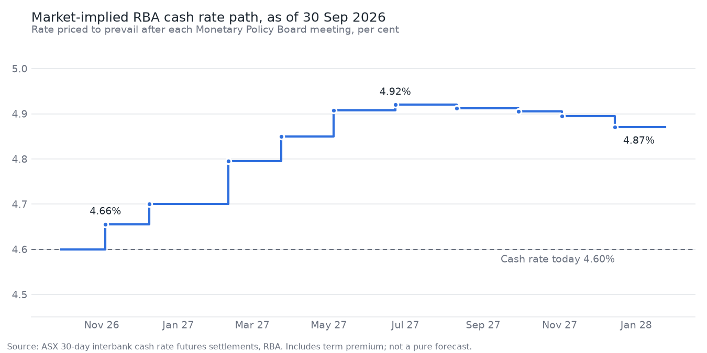

# RBA pricing note: 30 September 2026

_Prices are ASX 24 official settlements for 30 Sep 2026. Paper portfolio; not investment advice._

## 1. What is priced

Cash rate: **4.60%**. 3-year futures yield: **4.94%**. 10-year futures yield: **5.37%**. 3s10s: **44bp**.

| Meeting | Implied rate | Priced move (bp) | As share of 25bp | Cumulative (bp) |
|---|---|---|---|---|
| 03 Nov 2026 | 4.66% | +5.6 | +22% | +5.6 |
| 08 Dec 2026 | 4.70% | +4.4 | +18% | +10.0 |
| 09 Feb 2027 | 4.80% | +9.6 | +38% | +19.6 |
| 23 Mar 2027 | 4.85% | +5.4 | +22% | +25.0 |
| 04 May 2027 | 4.91% | +5.7 | +23% | +30.7 |
| 22 Jun 2027 | 4.92% | +1.3 | +5% | +32.0 |
| 10 Aug 2027 | 4.91% | -0.7 | -3% | +31.3 |
| 28 Sep 2027 | 4.91% | -0.8 | -3% | +30.5 |
| 02 Nov 2027 | 4.89% | -1.1 | -4% | +29.4 |
| 14 Dec 2027 | 4.87% | -2.4 | -10% | +27.0 |

### Next meeting scenarios (2026-11 IB contract)

| outcome_bp | price_now | final_settle | price_move_bp |
|---|---|---|---|
| -25 | 95.35 | 95.625 | 27.5 |
| 0 | 95.35 | 95.4 | 5.0 |
| 25 | 95.35 | 95.175 | -17.5 |

## 2. My view

<!-- Where do you disagree with the table above, and what is the specific
reason the market might be wrong (premium, overreaction, misread data detail)?
If you have no reason, say so and do not trade. -->

TODO

## 3. Trade

<!-- Instrument, direction, entry, stop, target, contracts, dollar risk at stop,
and why this instrument rather than the alternatives. -->

TODO

## 4. Open positions

_None._
